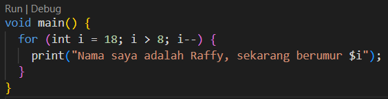
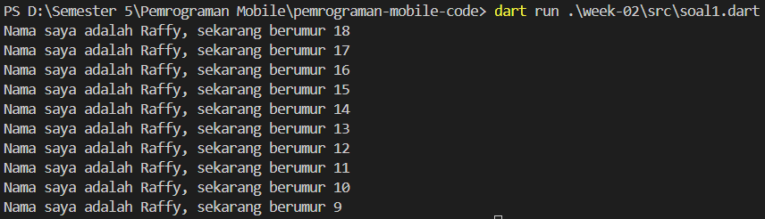

# Laporan Praktikum

<table>
  <tr>
    <th>Nama</th>
    <td>Raffy Jamil Octavialdy</td>
  </tr>
  <tr>
    <th>NIM</th>
    <td>2241720082</td>
  </tr>
  <tr>
    <th>Materi</th>
    <td>Variable dan Tipe Data</td>
  </tr>
</table>

## 1. Memodifikasi kode menjadi output yang diminta.

### Code

### Output

## 2. Mengapa sangat penting untuk memahami bahasa pemrograman Dart sebelum kita menggunakan framework Flutter ? Jelaskan!

Karena Flutter sepenuhnya dibangun di atas Dart, jadi untuk mengembangkan aplikasi menggunakan Flutter, kita harus memahami bahasa pemrograman Dart terlebih dahulu.

## 3. Rangkumlah materi dari codelab ini menjadi poin-poin penting yang dapat Anda gunakan untuk membantu proses pengembangan aplikasi mobile menggunakan framework Flutter.

### 1. Bahasa Dart adalah Inti dari Framework Flutter:
* Dart adalah bahasa utama yang digunakan dalam pengembangan aplikasi Flutter.
* Dart dipilih karena mampu menyediakan pengalaman pengembangan yang modern dan optimal.

### 2. Mengapa Dart Dipilih untuk Flutter:
* Dart menggabungkan kelebihan bahasa tingkat tinggi dengan fitur terbaru.
* Dart dapat dikompilasi menjadi kode native untuk berbagai platform, memungkinkan kinerja yang cepat dan responsif.
* Dart menyediakan alat produktif dan memiliki sistem garbage collection yang efisien, mendukung pengembangan aplikasi yang lebih mudah dan cepat.

### 3. Evolusi Dart:
* Diluncurkan pada tahun 2011, Dart awalnya difokuskan pada pengembangan web.
* Seiring waktu, Dart beralih fokus ke pengembangan mobile, terutama dalam integrasinya dengan Flutter.
* Dart telah berkembang menjadi bahasa yang mendukung proyek berskala besar dengan kinerja tinggi dan alat pengembangan yang kuat.

### 4. Cara Eksekusi Kode Dart:
* Dart dapat dieksekusi melalui Dart VM dengan mode Just-In-Time (JIT) atau Ahead-Of-Time (AOT), atau dikompilasi menjadi JavaScript untuk web.
* JIT mendukung debugging dan hot reload, sedangkan AOT digunakan untuk menghasilkan kode native yang cepat untuk berbagai platform.

### 5. Struktur Dasar Bahasa Dart:
* Dart adalah bahasa berorientasi objek dengan fitur seperti **encapsulation**, **inheritance**, **composition**, **abstraction**, dan **polymorphism**.
* Operator dalam Dart digunakan sebagai method dengan sintaks khusus, termasuk operator aritmatika, increment/decrement, equality/relational, dan logical.

### 6. Main Function dalam Dart:
* Function `main()` adalah titik awal eksekusi dalam setiap program Dart.
* Dart VM mencari function `main()` untuk memulai eksekusi kode, dan tipe data yang dikembalikan oleh function ini perlu didefinisikan (biasanya `void`).

### 7. Function vs. Method:
* `Function:` Fungsi yang berada di luar class dan tidak terikat pada objek tertentu.
* `Method:` Fungsi yang terikat pada objek (instance) dari class, dan memiliki akses ke data serta properti objek tersebut melalui referensi `this`.

## 4. Buatlah slide yang berisi penjelasan dan contoh eksekusi kode tentang perbedaan Null Safety dan Late variabel!
[Link Google Slide](https://docs.google.com/presentation/d/1O_XJU6dLNKV1lxGXejsEpmYCiGJEpPs4bVFctsWEWZ4/edit?usp=sharing)