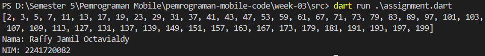

# Laporan Praktikum

<table>
  <tr>
    <th>Nama</th>
    <td>Raffy Jamil Octavialdy</td>
  </tr>
  <tr>
    <th>NIM</th>
    <td>2241720082</td>
  </tr>
  <tr>
    <th>Materi</th>
    <td>Control Flows and Looping</td>
  </tr>
</table>

# Praktikum 1: Menerapkan Control Flows ("if/else")

## Langkah 1
```dart
void main() {
  String test = "test2";

  if (test == "test1") {
    print("Test1");
  } else if (test == "test2") {
    print("Test2");
  } else {
    print("Something else");
  }

  if (test == "test2") print("Test2 again");
}
```

## Langkah 2

1. Pada baris pertama, mendeklarasi fungsi main(). Fungsi main() merupakan titik awal eksekusi program dalam bahasa pemrograman Dart.

2. Pada baris kedua, mendeklarasikan sebuah variabel bernama test dan menginisialisasinya dengan nilai string "test2".

3. Kemudian, terdapat struktur kontrol kondisional if-else. Ini digunakan untuk memeriksa nilai variabel test dan mencetak pesan berdasarkan kondisi berikut:
   - Jika test sama dengan "test1", maka program akan mencetak "Test1".
   - Jika test sama dengan "test2", maka program akan mencetak "Test2".
   - Jika test tidak sama dengan "test1" atau "test2" (kondisi default), maka program akan mencetak "Something else".
  
4. Di baris terakhir, terdapat pernyataan if terpisah yang memeriksa apakah test sama dengan "test2" lagi. Jika ya, maka program akan mencetak "Test2 again".

Secara keseluruhan, kode ini melakukan pemeriksaan kondisi pada variabel test dan mencetak pesan berdasarkan nilai variabel tersebut.

## Langkah 3
Perbaikan kode:
```dart
String test2 = "true";
if (test2 == "true") {
  print("Kebenaran");
}
```
atau
```dart
bool test2 = true;
if (test2) {
  print("Kebenaran");
}
```

1. Nama variable diubah menjadi `test2` agar tidak terjadi error karena nama variable test sudah digunakan sebelumnya.
2. Pada pengecekan `if(test)` diubah menjadi `if(test2 == "true")` agar sesuai dengan nilai yang diinisialisasikan pada variable `test2`. Ini karena variable `test2` bertipe string, sehingga harus dibandingkan dengan string juga.
3. Pengecekan `if(test)` bisa juga diubah menjadi `if(test2)` dengan catatan variable `test2` bertipe data boolean.

# Praktikum 2: Menerapkan Perulangan "while" dan "do-while"

## Langkah 1
```dart
void main() {
  while (counter < 33) {
    print(counter);
    counter++;
  }
}
```

## Langkah 2


Terjadi error karena variable counter belum dideklarasikan sebelumnya.

Perbaikan kode:
```dart
void main() {
  int counter = 0; // Mendeklarasikan dan menginisialisasi variabel counter

  while (counter < 33) {
    print(counter);
    counter++;
  }
}
```
Setelah dideklarasikan dan diinisialisasi, kode program dapat berjalan dengan baik.


## Langkah 3
```dart
void main() {
  do {
    print(counter);
    counter++;
  } while (counter < 77);
}
```

Error karena variable counter belum dideklarasikan sebelumnya.


Perbaikan kode:
```dart
void main() {
  int counter = 0;

  do {
    print(counter);
    counter++;
  } while (counter < 77);
}
```

Setelah dideklarasikan, maka program dapat berjalan dengan baik.


# Praktikum 3: Menerapkan Perulangan "for" dan "break-continue"

## Langkah 1
```dart
void main() {
  for (index = 10; index < 27; index) {
    print(index);
  }
}
```

## Langkah 2


Terjadi error karena variable `index` belum dideklarasikan sebelumnya dan operasi increment pada variable `index` tidak ada.

Solusinya adalah dengan mendeklarasikan variable `index` terlebih dahulu dengan cara menambahkan tipe data `int` sebelum nama variable. Kemudian, pada operasi increment, tambahkan `index++` agar variable `index` dapat terus bertambah.

```dart
void main() {
  for (int index = 10; index < 27; index++) {
    print(index);
  }
}
```

Setelah dideklarasikan, maka program dapat berjalan dengan baik.


## Langkah 3
```dart
void main() {
  for (int index = 10; index < 27; index++) {
    if (index == 21) {
      break;
    } else if (index > 1 || index < 7) {
      continue;
    }
    
    print(index);
  }
}
```

Pada kode ini, tidak terjadi error. Namun, output yang dihasilkan tidak sesuai dengan yang diharapkan. Ketika dijalankan, tidak ada output yang keluar, ini karena pada kondisi `else if(index > 1 || index < 7)` akan selalu terpenuhi karena `index > 1` akan selalu `true`, sehingga setiap iterasi akan melakukan continue dan tidak akan mencetak apapun. Solusinya adalah mengganti operator `||` menjadi `&&` agar hanya melakukan continue ketika `index > 1` dan `index < 7`.

```dart
void main() {
  for (int index = 10; index < 27; index++) {
    if (index == 21) {
      break;
    } else if (index > 1 && index < 7) {
      continue;
    }

    print(index);
  }
}
```

Maka, program dapat berjalan dengan baik.


# Tugas Praktikum
Buatlah sebuah program yang dapat menampilkan bilangan prima dari angka 0 sampai 201 menggunakan Dart. Ketika bilangan prima ditemukan, maka tampilkan nama lengkap dan NIM Anda.

```dart
void main() {
  int maxNumber = 201;
  List<int> PrimeNumbers = [];

  for (int i = 0; i < maxNumber; i++) {
    if (isPrime(i)) {
      PrimeNumbers.add(i);
    }
  }

  if (PrimeNumbers.isNotEmpty) {
    print(PrimeNumbers);
    print("Nama: Raffy Jamil Octavialdy");
    print("NIM: 2241720082");
  }
}

// Fungsi menentukan apakah sebuah angka adalah bilangan prima
bool isPrime(int number) {
  if (number < 2) {
    return false;
  }

  for (int i = 2; i < number; i++) {
    if (number % i == 0) {
      return false;
    }
  }

  return true;
}
```

Output:



#### Fungsi main()
- `int maxNumber = 201` Ini menginisialisasi variabel maxNumber dengan nilai 201. Variabel ini digunakan sebagai batas atas dalam loop untuk mencari bilangan prima.
- `List<int> PrimeNumbers = []` Ini menginisialisasi sebuah list kosong PrimeNumbers yang akan digunakan untuk menyimpan bilangan prima yang ditemukan.
- `for (int i = 0; i < maxNumber; i++) { ... }` Loop ini berjalan dari `i = 0` hingga `i < maxNumber`, yaitu dari 0 hingga 200. Setiap nilai i diperiksa apakah itu bilangan prima menggunakan fungsi isPrime(i).
- `if (isPrime(i)) { PrimeNumbers.add(i); }` Jika angka i adalah bilangan prima (yaitu, fungsi isPrime(i) mengembalikan true), angka tersebut ditambahkan ke list PrimeNumbers menggunakan PrimeNumbers.add(i).
- `if (PrimeNumbers.isNotEmpty) { ... }` Setelah loop selesai, program memeriksa apakah list PrimeNumbers tidak kosong. Jika list tidak kosong, program akan mencetak daftar bilangan prima yang ditemukan.
- `print(PrimeNumbers)` Mencetak list PrimeNumbers yang berisi bilangan prima dari 0 hingga 200.
- `print("Nama: Raffy Jamil Octavialdy")` Mencetak nama dan `print("NIM: 2241720082")` Mencetak NIM.

#### Fungsi isPrime(int number)
- `bool isPrime(int number)` Ini adalah sebuah fungsi yang menerima sebuah bilangan bulat number sebagai input dan mengembalikan true jika number adalah bilangan prima, dan false jika tidak.
- `if (number < 2) { return false; }` Bilangan prima didefinisikan sebagai bilangan bulat positif yang lebih besar dari 1. Jika number kurang dari 2, maka number bukan bilangan prima, dan fungsi ini langsung mengembalikan false.
- `for (int i = 2; i < number; i++) { ... }` Loop ini dimulai dari i = 2 hingga i < number. Tujuan dari loop ini adalah untuk memeriksa apakah number dapat dibagi habis oleh bilangan lain selain 1 dan dirinya sendiri. Jika ada angka i di mana `number % i == 0`, maka number bukan bilangan prima, dan fungsi mengembalikan false.
- `return true;` Jika loop selesai tanpa menemukan pembagi i yang membuat `number % i == 0`, maka number adalah bilangan prima, dan fungsi ini mengembalikan true.