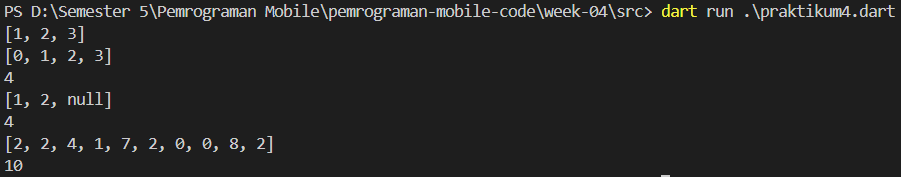

# Laporan Praktikum

<table>
  <tr>
    <th>Nama</th>
    <td>Raffy Jamil Octavialdy</td>
  </tr>
  <tr>
    <th>NIM</th>
    <td>2241720082</td>
  </tr>
  <tr>
    <th>Materi</th>
    <td>Collections, Records and Functions</td>
  </tr>
</table>

# Praktikum 1: Eksperimen Tipe Data List

## Langkah 1
```dart
void main() {
  var list = [1, 2, 3];
  assert(list.length == 3);
  assert(list[1] == 2);
  print(list.length);
  print(list[1]);

  list[1] = 1;
  assert(list[1] == 1);
  print(list[1]);
}
```

## Langkah 2
Setelah dijalankan, maka akan muncul output seperti berikut:


Ini terjadi karena pada baris ke-7, nilai dari index ke-1 pada list diubah menjadi 1. Sehingga, ketika dijalankan, maka nilai dari index ke-1 pada list akan menjadi 1.

Fungsi `assert` memeriksa apakah ekspresi yang diberikan benar atau tidak. Jika ekspresi benar, maka fungsi `assert` akan mengembalikan `true`, dan jika ekspresi salah, maka fungsi `assert` akan mengembalikan `false`.

## Langkah 3
> Ubah kode pada langkah 1 menjadi variabel final yang mempunyai index = 5 dengan default value = `null`. Isilah nama dan NIM Anda pada elemen index ke-1 dan ke-2. Lalu print dan capture hasilnya.
```dart
final List<String?> list = List.filled(5, null);
list[1] = 'Raffy Jamil Octavialdy';
list[2] = '2241720082';
print(list);
```

Setelah dijalankan, maka akan muncul output seperti berikut:


Fungsi `List.filled` digunakan untuk mengisi list dengan nilai yang sama. Fungsi ini menerima 2 parameter yaitu jumlah list yang diinginkan dan nilai yang akan digunakan untuk mengisi list. Pada contoh di atas, jumlah list yang diinginkan adalah 5, dan nilai yang akan digunakan untuk mengisi list adalah `null`. Fungsi `List.filled` mengembalikan list baru yang berisi nilai yang sama.

# Praktikum 2: Eksperimen Tipe Data Set

## Langkah 1
```dart
void main() {
  var halogens = {'fluorine', 'chlorine', 'bromine', 'iodine', 'astatine'};
  print(halogens);
}
```

## Langkah 2
Setelah dijalankan, maka akan muncul output seperti berikut:


Pada contoh di atas, variabel halogens berisi set dari 5 elemen. Set ini berisi semua elemen yang ada di dalam variabel halogens. Jika ada 2 nilai elemen yang sama, set akan mengembalikan 1 elemen saja.

## Langkah 3

> Tambahkan kode program berikut, lalu coba eksekusi (Run) kode Anda.

```dart
var names1 = <String>{};
Set<String> names2 = {}; // This works, too.
var names3 = {}; // Creates a map, not a set.

print(names1);
print(names2);
print(names3);
```

Setelah dijalankan, maka akan muncul output seperti berikut:


Contoh kode di atas adalah beberapa cara untuk membuat `set`, kecuali untuk variabel `names3` itu untuk membuat `Map` bukan `Set`.

Kemudian saya menambahkan kode untuk menambahkan elemen nama dan NIM pada variabel Set:

```dart
void main() {
  var names1 = <String>{};
  Set<String> names2 = {}; // This works, too.

  names1.add('Raffy Jamil Octavialdy');
  names1.add('2241720082');
  names2.addAll({'Raffy Jamil Octavialdy', '2241720082'});

  print(names1);
  print(names2);
}
```

Setelah dijalankan, maka akan muncul output seperti berikut:


Fungsi `.add()` digunakan untuk menambahkan elemen baru ke dalam set. Fungsi `.addAll()` digunakan untuk menambahkan semua elemen dari set lain ke dalam set saat ini.

# Praktikum 3: Eksperimen Tipe Data Map

## Langkah 1
```dart
void main() {
  var gifts = {
    // Key:    Value
    'first': 'partridge',
    'second': 'turtledoves',
    'fifth': 1
  };

  var nobleGases = {
    2: 'helium',
    10: 'neon',
    18: 2,
  };

  print(gifts);
  print(nobleGases);
}
```

## Langkah 2
Setelah dijalankan, maka akan muncul output seperti berikut:


Pada contoh di atas, variabel gifts berisi map yang memiliki 3 elemen dan. Map ini berisi semua elemen yang ada di dalam variabel gifts. Map ini berisikan key-value yang berbeda-beda.

## Langkah 3

> Tambahkan kode program berikut, lalu coba eksekusi (Run) kode Anda.

```dart
var mhs1 = Map<String, String>();
gifts['first'] = 'partridge';
gifts['second'] = 'turtledoves';
gifts['fifth'] = 'golden rings';

var mhs2 = Map<int, String>();
nobleGases[2] = 'helium';
nobleGases[10] = 'neon';
nobleGases[18] = 'argon';
```

> Tambahkan elemen nama dan NIM Anda pada tiap variabel di atas (gifts, nobleGases, mhs1, dan mhs2). Dokumentasikan hasilnya dan buat laporannya!

```dart
var mhs1 = Map<String, String>();
gifts['first'] = 'partridge';
gifts['second'] = 'turtledoves';
gifts['fifth'] = 'golden rings';

var mhs2 = Map<int, String>();
nobleGases[2] = 'helium';
nobleGases[10] = 'neon';
nobleGases[18] = 'argon';

mhs1['nama'] = 'Raffy Jamil Octavialdy';
mhs1['nim'] = '2241720082';

mhs2[1] = 'Raffy Jamil Octavialdy';
mhs2[2] = '2241720082';

print(gifts);
print(nobleGases);
print(mhs1);
print(mhs2);
```


Kode di atas untuk membuat map `mhs1` dan `mhs2` dibuat dengan cara menambahkan elemen ke dalam map dengan key-value yang berbeda-beda. Jika key yang digunakan sudah ada di dalam map, maka nilai yang baru akan ditambahkan ke dalam key tersebut.

# Praktikum 4: Eksperimen Tipe Data List: Spread dan Control-flow Operators

## Langkah 1
```dart
void main() {
  var list = [1, 2, 3];
  var list2 = [0, ...list];
  print(list1);
  print(list2);
  print(list2.length);
}
```

## Langkah 2

Terjadi error karena variabel `list1` tidak didefinisikan. Kemudian saya mengubahnya menjadi `list` seperti berikut:

```dart
void main() {
  var list = [1, 2, 3];
  var list2 = [0, ...list];
  print(list);
  print(list2);
  print(list2.length);
}
```

Setelah dijalankan, maka akan muncul output seperti berikut:


Spread operator `...` digunakan untuk menggabungkan elemen dari sebuah list ke dalam list lain. Contoh kode di atas menggabungkan elemen dari list `list` ke dalam list `list2`.

## Langkah 3
> Tambahkan kode program berikut, lalu coba eksekusi (Run) kode Anda.

```dart
list1 = [1, 2, null];
print(list1);
var list3 = [0, ...?list1];
print(list3.length);
```

Terjadi error


Kemudian saya mengubahnya menjadi seperti berikut:

```dart
void main() {
  List<int?> list = [1, 2, 3];
  var list2 = [0, ...list];
  print(list);
  print(list2);
  print(list2.length);

  list = [1, 2, null];
  print(list);
  var list3 = [0, ...?list];
  print(list3.length);
}
```

Setelah dijalankan, maka akan muncul output seperti berikut:


> Tambahkan variabel list berisi NIM Anda menggunakan Spread Operators. Dokumentasikan hasilnya dan buat laporannya!

Ketika saya tambahkan kodenya menjadi seperti berikut

```dart
void main() {
  List<int?> list = [1, 2, 3];
  var list2 = [0, ...list];
  print(list);
  print(list2);
  print(list2.length);

  list = [1, 2, null];
  print(list);
  var list3 = [0, ...?list];
  print(list3.length);

  var nimA = [2, 2, 4, 1, 7];
  var nimB = [2, 0, 0, 8, 2];
  var list4 = [...nimA, ...nimB];
  print(list4);
  print(list4.length);
}
```

Setelah dijalankan, maka akan muncul output seperti berikut:



## Langkah 4

> Tambahkan kode program berikut, lalu coba eksekusi (Run) kode Anda.

```dart
var nav = ['Home', 'Furniture', 'Plants', if (promoActive) 'Outlet'];
print(nav);
```

> Apa yang terjadi ? Jika terjadi error, silakan perbaiki. Tunjukkan hasilnya jika variabel promoActive ketika true dan false.

Terjadi error karena variable `promoActive` tidak didefinisikan. Kemudian saya mengubahnya menjadi seperti berikut:

```dart
void main() {
  var promoActive = true;
  var nav = ['Home', 'Furniture', 'Plants', if (promoActive) 'Outlet'];
  print(nav);
}
```

output:

`promoActive = true`

```bash
$ dart run week-04/src/praktikum4.dart
[Home, Furniture, Plants, Outlet]
```

`promoActive = false`

```bash
$ dart run week-04/src/praktikum4.dart
[Home, Furniture, Plants]
```

`if (promoActive)` digunakan untuk mengontrol apakah variabel `promoActive` bernilai `true` atau `false`. Jika `promoActive` bernilai `true`, maka `if (promoActive)` akan mengembalikan `Outlet`, dan `Outlet` akan ditambahkan ke dalam list `nav`. Jika `promoActive` bernilai `false`, maka `if (promoActive)` akan mengembalikan `null`, dan `null` tidak akan ditambahkan ke dalam list `nav`.

## Langkah 5

> Tambahkan kode program berikut, lalu coba eksekusi (Run) kode Anda.

```dart
var nav2 = ['Home', 'Furniture', 'Plants', if (login case 'Manager') 'Inventory'];
print(nav2);
```

> Apa yang terjadi ? Jika terjadi error, silakan perbaiki. Tunjukkan hasilnya jika variabel login mempunyai kondisi lain.

Terjadi error karena variable `login` tidak didefinisikan. Kemudian saya mengubahnya menjadi seperti berikut:

```dart
void main() {
  String login = 'Manager';
  var nav2 = [
    'Home',
    'Furniture',
    'Plants',
    if (login case 'Manager') 'Inventory'
  ];
  print(nav2);
}
```

Ketika dijalankan dengan `login = 'Manager'`, maka akan muncul output seperti berikut:

```bash
$ dart run week-04/src/praktikum4.dart
[Home, Furniture, Plants, Inventory]
```

Ketika dijalankan dengan `login = 'User'`, maka akan muncul output seperti berikut:

```bash
$ dart run week-04/src/praktikum4.dart
[Home, Furniture, Plants]
```

`if (login case 'Manager')` digunakan untuk mengontrol apakah variabel `login` bernilai `Manager` atau `User`. Jika `login` bernilai `Manager`, maka `if (login case 'Manager')` akan mengembalikan `Inventory`, dan `Inventory` akan ditambahkan ke dalam list `nav2`. Jika `login` bernilai `User`, maka `if (login case 'Manager')` akan mengembalikan `null`, dan `null` tidak akan ditambahkan ke dalam list `nav2`.

## Langkah 6

> Tambahkan kode program berikut, lalu coba eksekusi (Run) kode Anda.

```dart
var listOfInts = [1, 2, 3];
var listOfStrings = ['#0', for (var i in listOfInts) '#$i'];
assert(listOfStrings[1] == '#1');
print(listOfStrings);
```

Apa yang terjadi ? Jika terjadi error, silakan perbaiki. Jelaskan manfaat Collection For dan dokumentasikan hasilnya.

Ketika dijalankan, maka akan muncul output seperti berikut:

```bash
$ dart run week-04/src/praktikum4.dart
[#0, #1, #2, #3]
```

**Collection For** dalam Dart adalah fitur yang memungkinkan untuk membuat list baru berdasarkan elemen-elemen dari list yang sudah ada, dengan menambahkan logika pemrosesan pada setiap elemen tersebut. Di sini, `listOfStrings` dibuat dengan memanfaatkan **Collection For** untuk mengiterasi `listOfInts` dan menambahkan string `#` di depan setiap elemen dari `listOfInts`. Hasilnya adalah list baru `['#0', '#1', '#2', '#3']`.

# Praktikum 5

## Langkah 1

> Ketik atau salin kode program berikut ke dalam fungsi main().

```dart
void main() {
  var record = ('first', a: 2, b: true, 'last');
  print(record);
}
```

## Langkah 2
Ketika dijalankan, maka akan muncul output seperti berikut:

```bash
$ dart run week-04/src/praktikum5.dart
(first, last, a: 2, b: true)
```

## Langkah 3

> Tambahkan kode program berikut di luar scope `void main()`, lalu coba eksekusi (Run) kode Anda.

```dart
(int, int) tukar((int, int) record) {
  var (a, b) = record;
  return (b, a);
}
```

> Apa yang terjadi ? Jika terjadi error, silakan perbaiki. Gunakan fungsi tukar() di dalam main() sehingga tampak jelas proses pertukaran value field di dalam Records.

Berikut setelah saya tambahkan kode di atas:

```dart
void main() {
  var record = (2, 3);
  print(record);
  print(tukar(record));
}

(int, int) tukar((int, int) record) {
  var (a, b) = record;
  return (b, a);
}
```

Setelah dijalankan, maka akan muncul output seperti berikut:

```bash
$ dart run week-04/src/praktikum5.dart
(2, 3)
(3, 2)
```

## Langkah 4

> Tambahkan kode program berikut di dalam scope void main(), lalu coba eksekusi (Run) kode Anda.

```dart
// Record type annotation in a variable declaration:
(String, int) mahasiswa;
print(mahasiswa);
```

> Apa yang terjadi ? Jika terjadi error, silakan perbaiki. Inisialisasi field nama dan NIM Anda pada variabel record mahasiswa di atas. Dokumentasikan hasilnya dan buat laporannya!

Kode tersebut menghasilkan error karena nilainya belum diinisialisasi, berikut setelah saya tambahkan kode untuk inisialisasi

```dart
void main() {
  (String, int) mahasiswa = ('Raffy Jamil Octavialdy', 2241720082);
  print(mahasiswa);
}
```

Setelah dijalankan, maka akan muncul output seperti berikut:

```bash
$ dart run week-04/src/praktikum5.dart
(Raffy Jamil Octavialdy, 2241720082)
```

## Langkah 5
> Tambahkan kode program berikut di dalam scope void main(), lalu coba eksekusi (Run) kode Anda.

```dart
var mahasiswa2 = ('first', a: 2, b: true, 'last');

print(mahasiswa2.$1); // Prints 'first'
print(mahasiswa2.a); // Prints 2
print(mahasiswa2.b); // Prints true
print(mahasiswa2.$2); // Prints 'last'
```

> Apa yang terjadi ? Jika terjadi error, silakan perbaiki. Gantilah salah satu isi record dengan nama dan NIM Anda, lalu dokumentasikan hasilnya dan buat laporannya!

Tidak terjadi error
  
```bash
$ dart run week-04/src/praktikum5.dart
first
2
true
last
```

Kemudian saya mengubahnya menjadi seperti berikut:

```dart
void main() {
  var mahasiswa2 = ('Raffy Jamil Octavialdy', a: 2241720082, b: true, 'last');

  print(mahasiswa2.$1);
  print(mahasiswa2.a);
  print(mahasiswa2.b);
  print(mahasiswa2.$2);
}
```

Setelah dijalankan, maka akan muncul output seperti berikut:

```bash
$ dart run week-04/src/praktikum5.dart
Raffy Jamil Octavialdy
2241720082
true
last
```

# Tugas Praktikum
1. Silakan selesaikan Praktikum 1 sampai 5, lalu dokumentasikan berupa screenshot hasil pekerjaan Anda beserta penjelasannya!
    - Sudah selesai.
2. Jelaskan yang dimaksud Functions dalam bahasa Dart!
    - Functions dalam Dart adalah blok kode yang dapat dieksekusi, dirancang untuk melakukan tugas tertentu dan dapat dipanggil berkali-kali dalam program. Fungsi dapat menerima input dalam bentuk parameter dan mengembalikan output.
3. Jelaskan jenis-jenis parameter di Functions beserta contoh sintaksnya!
    ##### Named Parameter
      Named parameter adalah parameter yang diberi nama. Named parameter dapat diberikan nilai default. Named parameter dapat diberikan nilai default dengan menggunakan `=`.
    ##### Required Named Parameter
       - Required named parameter adalah named parameter yang tidak diberi nilai default.
         - Penulisan:
           ```dart
           void main() {
              // Fungsi dengan required named parameters
              void createUserProfile({
                required String name,
                required int age,
                required String email,
              }) {
                print("Name: $name");
                print("Age: $age");
                print("Email: $email");
              }

              // Pemanggilan fungsi dengan mengisi semua required parameters
              createUserProfile(name: "Raffy Jamil", age: 27, email: "raffy@example.com");
            } 
          ```
    ##### Optional Named Parameter
        - Optional named parameter adalah named parameter yang diberi nilai default.
          - Penulisan:
            ```dart
            void main() {
              // Fungsi dengan optional named parameters
              void createUser({
                String name = "Guest",
                int age = 18,
                String country = "Unknown",
              }) {
                print("Name: $name");
                print("Age: $age");
                print("Country: $country");
              }

              // Pemanggilan fungsi dengan sebagian optional parameters
              createUser(name: "Raffy Jamil", country: "Indonesia");

              // Pemanggilan fungsi tanpa memberikan parameter (akan menggunakan nilai default)
              createUser();
            }
              ```
    ##### Positional Parameter
    ##### Required Positional Parameter
        - Required positional parameter adalah positional parameter yang tidak diberi nilai default.
          - Penulisan:
            ```dart
              void main() {
                // Fungsi dengan required positional parameters
                int calculateArea(int length, int width) {
                  return length * width;
                }

                // Pemanggilan fungsi dengan memberikan nilai untuk semua required parameters
                int area = calculateArea(5, 10);
                print("Area: $area");
              }
              ```
    ##### Optional Positional Parameter
        - Optional positional parameter adalah positional parameter yang diberi nilai default.
          - Penulisan:
            ```dart
              void main() {
                // Fungsi dengan optional positional parameter
                double calculateTotalPrice(double price, int quantity, [double discount = 0.0]) {
                  double total = price * quantity;
                  if (discount > 0) {
                    total -= total * discount;
                  }
                  return total;
                }

                // Pemanggilan fungsi tanpa optional parameter (menggunakan nilai default untuk discount)
                print("Total Price: ${calculateTotalPrice(50.0, 2)}");

                // Pemanggilan fungsi dengan optional parameter
                print("Total Price with discount: ${calculateTotalPrice(50.0, 2, 0.1)}");
              }
              ```
4. Jelaskan maksud Functions sebagai first-class objects beserta contoh sintaknya!
   - Functions sebagai first-class objects artinya fungsi dapat disimpan dalam variabel, dikirim sebagai parameter ke fungsi lain, dan dikembalikan dari fungsi lain.
   - Contoh:
     ```dart
     void main() {
        // Menyimpan fungsi dalam variabel
        var calculateArea = (int length, int width) {
          return length * width;
        };

        // Mengirim fungsi sebagai parameter
        void printCalculation(int a, int b, Function operation) {
          print("Result: ${operation(a, b)}");
        }

        // Memanggil fungsi
        printCalculation(5, 10, calculateArea);

        // Mengembalikan fungsi dari fungsi lain
        Function multiplyBy(int multiplier) {
          return (int value) => value * multiplier;
        }

        var triple = multiplyBy(3);
        print("Triple of 4: ${triple(4)}");
      }
     ```
5. Apa itu Anonymous Functions? Jelaskan dan berikan contohnya!
     - Anonymous Functions adalah fungsi yang tidak memiliki nama. Anonymous Functions dapat disimpan dalam variabel, dikirim sebagai parameter ke fungsi lain, dan dikembalikan dari fungsi lain.
   - Contoh:
     ```dart
     void main() {
      // Anonymous function disimpan dalam variabel
      var greet = (String name) {
        return 'Hello, $name!';
      };

      print(greet('Raffy'));

      // Anonymous function sebagai parameter
      var numbers = [1, 2, 3, 4, 5];
      var doubledNumbers = numbers.map((number) {
        return number * 2;
      }).toList();

      print(doubledNumbers); // Output: [2, 4, 6, 8, 10]

      // Menggunakan anonymous function dalam event handler sederhana
      var buttonClicked = () {
        print('Button clicked!');
      };

      buttonClicked(); // Output: Button clicked!
     }
     ```
6. Jelaskan perbedaan Lexical scope dan Lexical closures! Berikan contohnya!
    - Lexical Scope
      - Lexical scope (atau static scope) adalah aturan yang menentukan di mana variabel bisa diakses dalam kode berdasarkan tempat di mana variabel tersebut dideklarasikan.
      - Jika suatu variabel dideklarasikan di luar sebuah fungsi (global scope), maka fungsi itu dapat mengakses variabel tersebut. Namun, variabel yang dideklarasikan di dalam fungsi tidak dapat diakses di luar fungsi tersebut.
      - Cakupan variabel diputuskan saat kode ditulis (bukan saat runtime), dengan mengikuti struktur kurung kurawal {}.
      ```dart
      void main() {
        int outerVar = 100; // Variabel di luar

        void innerFunction() {
          int innerVar = 200; // Variabel lokal dalam fungsi
          print(outerVar); // outerVar bisa diakses di sini
        }

        innerFunction();
        // print(innerVar); // Akan menyebabkan error karena innerVar hanya bisa diakses dalam innerFunction
      }
      ```
    - Lexical Closure
      - Lexical closure terjadi ketika suatu fungsi bersarang (nested function) "menangkap" variabel dari lingkup sekitarnya, meskipun fungsi tersebut dieksekusi di luar cakupan di mana variabel itu dideklarasikan.
      - Closure memungkinkan fungsi untuk tetap "ingat" terhadap lingkungannya, bahkan setelah lingkungan tersebut selesai dieksekusi.
      - Closure adalah kombinasi antara sebuah fungsi dan lingkungan tempat fungsi itu diciptakan, termasuk variabel-variabel yang tersedia di lingkungan tersebut.
      ```dart
      void main() {
        Function makeMultiplier(int factor) {
          return (int value) => factor * value; // fungsi mengakses variabel dari luar (factor)
        }

        var multiplierBy2 = makeMultiplier(2);
        print(multiplierBy2(5)); // Output: 10

        var multiplierBy3 = makeMultiplier(3);
        print(multiplierBy3(5)); // Output: 15
      }
      ```
7. Jelaskan dengan contoh cara membuat return multiple value di Functions!
   - Untuk membuat return multiple value di Functions, kita dapat menggunakan `Record`.
   - Contoh:
     ```dart
      // Fungsi yang mengembalikan record dengan multiple values
      (String, int, String) getPersonInfo() {
        return ('Raffy Jamil Octavialdy', 20, 'Indonesia');
      }

      void main() {
        // Destructuring record ke dalam variabel individual
        var (name, age, country) = getPersonInfo();

        print('Name: $name');
        print('Age: $age');
        print('Country: $country');
      }
     ```
8. Kumpulkan berupa link commit repo GitHub pada tautan yang telah disediakan di grup Telegram!
    - Sudah selesai.